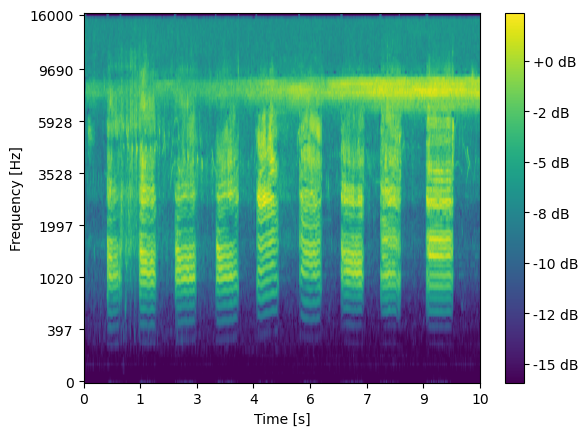
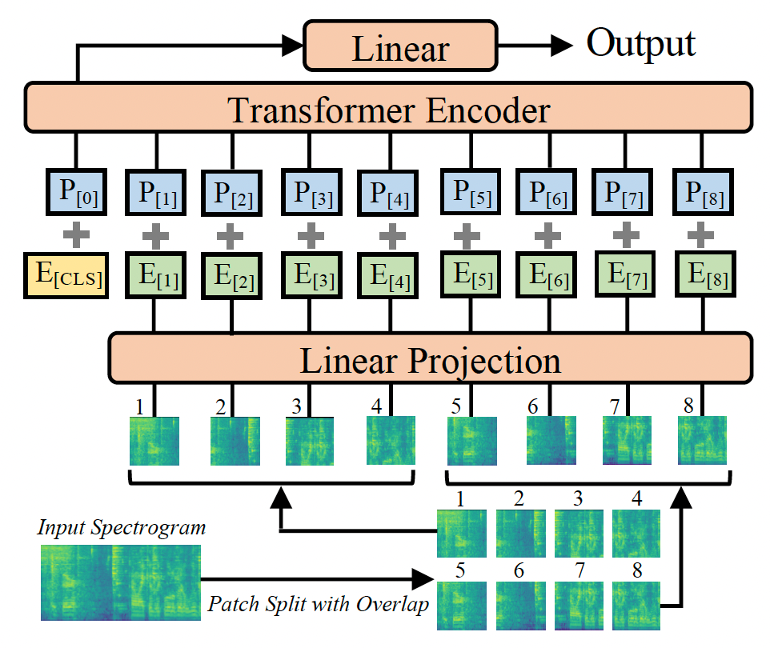
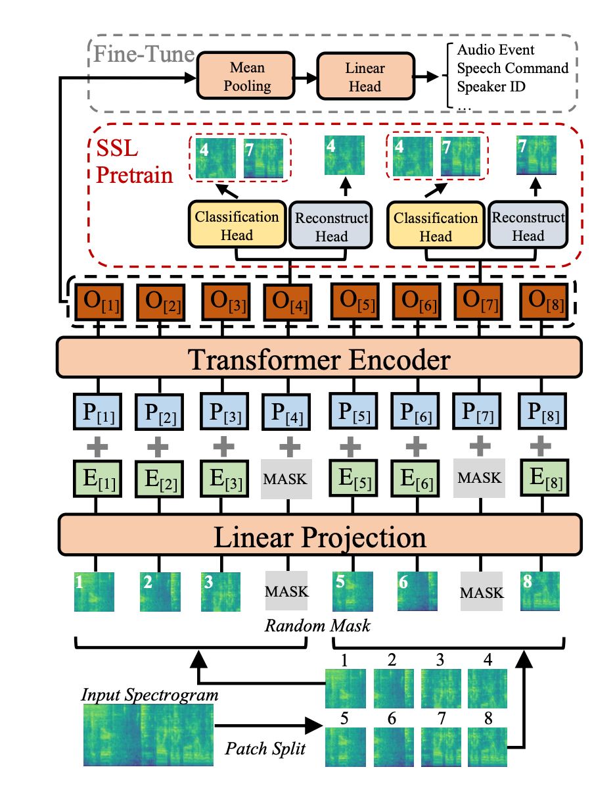
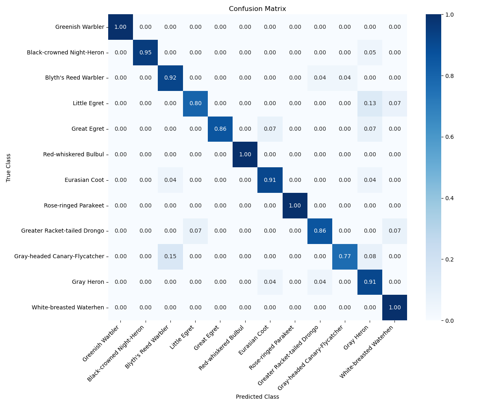

# Bird Call Identifier: Learning From Limited Labeled Data

This repository contains our research-driven implementation of **bird call classification** using **transfer learning across modalities**, adapted from the **Audio Spectrogram Transformer (AST)** and **Self-Supervised Audio Spectrogram Transformer (SSAST)** models. This work builds upon **AST: Audio Spectrogram Transformer** (Gong et al.) and **SSAST: Self-Supervised Audio Spectrogram Transformer** methodologies to classify bird species from audio recordings with **limited labeled data**.

## Task Overview

The goal of this project is to **identify bird species from their calls** using deep learning techniques on spectrogram representations. Given a **12 × 1024 × 128** filter bank array (processed from raw audio), our model predicts **one of 12 bird species**, including:

- Eurasian Coot
- Blyth’s Reed Warbler
- Gray Heron
- Greenish Warbler
- Black Crowned Night-Heron
- Rose-ringed Parakeet
- Greater Racket-tailed Drongo
- White-breasted Waterhen
- Gray-headed Canary-Flycatcher
- Great Egret
- Little Egret
- Red-whiskered Bulbul

<figure>
  
  <figcaption>Filter bank (Spectrogram) generated from  a Great Egret call.</figcaption>
</figure>

## Problem Statement

Many species of birds are **under-studied**, and **labeled audio datasets** for classification are often **scarce and expensive** to acquire due to:

- The need for **expert annotation** to differentiate species by sound.
- **Noise and interference** in real-world recordings.
- **Long identification times** compared to images.

This project explores **transfer learning from visual and self-supervised audio models** to improve classification performance with limited labeled data.

## Techniques Used

We investigate **multiple pretraining approaches** and **fine-tuning strategies** to maximize accuracy:

### **Audio Spectrogram Transformer (AST)**
- A purely **attention-based model** for audio classification.
- Pretrained on **ImageNet** (visual data) and **AudioSet** (audio clips).
- **Key hypothesis**: AST pretrained on **both ImageNet & AudioSet** will outperform ImageNet-only AST.

<figure>
  
  <figcaption>Representation of Audio Spectrogram Transformers.</figcaption>
</figure>

### **Self-Supervised Audio Spectrogram Transformer (SSAST)**
- A **self-supervised learning** framework for AST.
- Pretrained on **unlabeled** data from **AudioSet** and **Librispeech**.
- **Key hypothesis**: SSAST should fine-tune faster and perform better on limited data.

<figure>
  
  <figcaption>Representation of Self-Supervised Audio Spectrogram Transformers.</figcaption>
</figure>

### **Fine-Tuning Strategies**
- **Full-layer fine-tuning** vs. **last-layer fine-tuning**.
- **Balanced accuracy & mAP metrics** for model evaluation.
- **Avoiding data leakage

## **Results Achieved**
The best performing model was achieved through full fine-tuning of an AST model pretrained on ImageNet and AudioSet, which achieved 91.5% balanced accuracy, in addition to performing well at distinguishing similar species.
<figure>
  
  <figcaption>Confusion Matrix of best performing AST model.</figcaption>
</figure>

## **Source Models and Data**
- AST pretrained models from https://github.com/YuanGongND/ast/tree/master.
- Mel spectrogram generator script from https://www.kaggle.com/code/richolson/birdclef-2024-simple-mel-spectrogram-generator?scriptVersionId=171081311.
- Training data from https://www.kaggle.com/datasets/richolson/birdclef-2024-big-bird-193k-mel-spectrograms. Copy located at https://drive.google.com/file/d/18f__urXzVmEu8lHLLOW_BezyCN-34pPl/view?usp=drive_link - Download the train_folder.zip file and unzip it into ./Data/.
